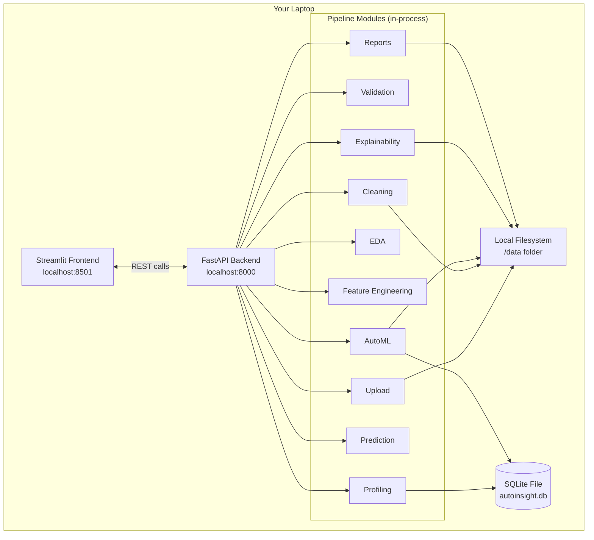
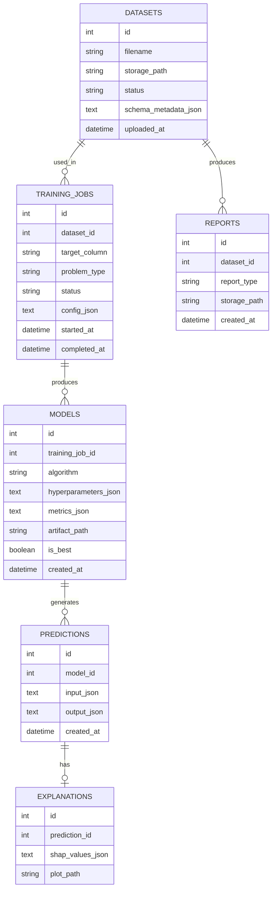
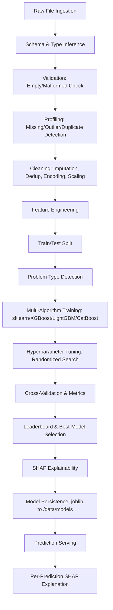

# Product Requirements Document
## AutoInsight — A Local AutoML & Explainable AI Platform
**Portfolio Project for a Junior Python Developer / Data Scientist**

| Field | Value |
|---|---|
| Document Owner | Solo Developer (You) |
| Status | Draft — Ready for Implementation |
| Version | 2.0 (Local Edition) |
| Last Updated | June 25, 2026 |
| Target Audience | Yourself, recruiters/interviewers reviewing your GitHub |
| Build Timeline | 4–6 weeks, part-time, single developer |

---

## Table of Contents

1. [Executive Summary](#1-executive-summary)
2. [Problem Statement](#2-problem-statement)
3. [Solution Overview](#3-solution-overview)
4. [User Personas](#4-user-personas)
5. [Technical Architecture](#5-technical-architecture)
6. [Functional Requirements](#6-functional-requirements)
7. [API Specifications](#7-api-specifications)
8. [Data Models](#8-data-models)
9. [Machine Learning Pipeline](#9-machine-learning-pipeline)
10. [Implementation Plan](#10-implementation-plan)
11. [Success Metrics](#11-success-metrics)
12. [Future Enhancements](#12-future-enhancements)

---

## 1. Executive Summary

### 1.1 Vision & Value Proposition

AutoInsight is a **fully local**, no-code data science application: a single Python developer can run it on their own laptop, upload a CSV or Excel file, and walk away with a profiled, cleaned, modeled, and explained dataset — without writing a line of modeling code at runtime. It exists primarily as a **flagship portfolio project**: it demonstrates, in one coherent codebase, the full skill set a hiring manager looks for in a junior data scientist or Python developer — clean architecture, FastAPI backend engineering, SQLAlchemy/SQLite data modeling, applied machine learning with multiple libraries (scikit-learn, XGBoost, LightGBM, CatBoost), explainable AI with SHAP, data visualization with Plotly, and a working Streamlit front end.

Unlike the original enterprise concept, AutoInsight intentionally has **no cloud dependencies, no distributed infrastructure, and no multi-user complexity**. Everything — uploaded files, the database, trained models, generated reports — lives in a simple, well-organized folder on disk. This keeps the project achievable by one person in a few weeks, fully runnable with `pip install -r requirements.txt` and two terminal commands, and easy for an interviewer to clone and run locally in under five minutes.

The project still solves a real, demonstrable problem: turning raw tabular data into an explained predictive model without manual preprocessing. It just does so in a scope appropriate for a learning/portfolio context rather than a production SaaS product — while still using genuinely production-quality coding practices (typed code, modular services, tests, documentation) that translate directly to real engineering jobs.

### 1.2 Key Objectives & Measurable Metrics

| Objective | Metric | Target |
|---|---|---|
| Demonstrate full-stack data science skill | Modules implemented end-to-end | 10/10 (Upload → Reports) |
| Keep the project buildable solo | Total build time | 4–6 weeks, part-time |
| Automate preprocessing | Manual steps required from user | Near-zero (auto profiling/cleaning) |
| Support multiple ML algorithms | Algorithms benchmarked per run | ≥ 4 (sklearn, XGBoost, LightGBM, CatBoost) |
| Provide explainability | % of predictions with SHAP explanation | 100% |
| Be genuinely runnable locally | Setup steps for a new clone | ≤ 5 commands, no external services |
| Showcase clean code | Test coverage on core pipeline | ≥ 70% |

### 1.3 Expected Impact & Success Criteria

Success for this project looks like: a public GitHub repository with a clear README, a one-command local setup, a working Streamlit UI and FastAPI backend, and a recorded demo (or live demo in an interview) showing a dataset going from raw upload to an explained prediction in under a minute. Secondary success criteria include code that is readable and well-organized enough that another developer (or an interviewer skimming the repo) can understand the architecture within a few minutes, and a project that can credibly be discussed in depth during a technical interview — including tradeoffs made to keep it local-first and achievable solo.

---

## 2. Problem Statement

### 2.1 Current Situation

Most junior data science / Python portfolio projects fall into one of two categories: a single Jupyter notebook doing EDA on a well-known dataset (Titanic, Iris), or an overly ambitious "enterprise SaaS" idea that never gets finished because it requires cloud infrastructure, authentication systems, and DevOps knowledge the developer doesn't yet have time to build. Neither demonstrates the specific, hireable skill of building a *complete, working application* around a machine learning workflow.

### 2.2 Pain Points (as a Developer Building a Portfolio)

* Notebooks demonstrate analysis skill but not software engineering skill (no APIs, no architecture, no tests).
* Cloud-native portfolio projects are hard to finish solo and hard for a reviewer to actually run (they need AWS credentials, Docker registries, etc.).
* Many "AutoML" toy projects hardcode one dataset and don't generalize, undermining the "automated" claim.
* Explainability is often skipped entirely, even though it's one of the most interview-relevant ML topics today.

### 2.3 Opportunity

Build one well-scoped, fully local application that touches the entire tabular ML lifecycle — upload, validate, profile, clean, explore, engineer features, train multiple models, compare them, explain predictions, serve predictions via API, and generate reports — using a tech stack (FastAPI + SQLAlchemy + SQLite + scikit-learn ecosystem + SHAP + Streamlit) that is exactly what many junior data science/Python job postings list as desired skills.

### 2.4 Justification

This scope is justified because it is: (1) **achievable** by one developer in a few weeks of part-time work, (2) **runnable by anyone** with just Python and `pip` — no cloud account needed, (3) **technically deep enough** to discuss confidently in interviews (AutoML logic, SHAP internals, FastAPI design choices), and (4) **extensible** — the Future Enhancements section documents a credible path to "this could become a real product," which itself is a good interview talking point.

---

## 3. Solution Overview

### 3.1 End-to-End Workflow

```mermaid
flowchart LR
    A[Upload CSV/Excel] --> B[Validation]
    B --> C[Data Profiling]
    C --> D[Automated Cleaning]
    D --> E[EDA & Visualization]
    E --> F[Feature Engineering]
    F --> G[AutoML: Train Multiple Models]
    G --> H[Model Comparison / Leaderboard]
    H --> I[SHAP Explainability]
    I --> J[Report Generation - PDF/Excel]
    H --> K[Local Model Storage]
    K --> L[FastAPI Prediction Endpoint]
    L --> M[Single / Batch Predictions]
    M --> I
```



### 3.2 Architecture Rationale

AutoInsight keeps the **pipeline-as-stages** idea from the original concept — each stage (validation, cleaning, EDA, training, explainability, reporting) is its own Python module with a clear input/output contract — but runs it all **in a single process on a single machine**. FastAPI is still used for the backend because it's genuinely good practice (typed request/response models, automatic OpenAPI docs) and is a skill worth demonstrating, not because the project needs to handle concurrent enterprise traffic. SQLite replaces PostgreSQL because it requires zero setup (no server process to install/run) while still being accessed through the same SQLAlchemy ORM — meaning the data-access code is realistic and would port to PostgreSQL later with minimal changes (a good thing to mention in interviews).

### 3.3 Key Technical Decisions

| Decision | Rationale |
|---|---|
| SQLite + SQLAlchemy instead of PostgreSQL | Zero-install local persistence; ORM code stays portable to a real DB later |
| Local filesystem instead of S3 | No cloud account needed; simple, transparent folder structure |
| In-process training instead of Celery workers | No message broker to install; FastAPI `BackgroundTasks` keeps the UI responsive for longer-running training jobs |
| No authentication | Single-user local app; out of scope for a portfolio demo |
| Streamlit for UI | Fast to build, great for data-heavy interactive views, no separate frontend build step |
| Multi-library AutoML (sklearn + XGBoost + LightGBM + CatBoost) | Demonstrates breadth; lets the leaderboard show genuinely different model families |
| SHAP for explainability | Industry-standard, well-documented, model-agnostic, strong interview talking point |

### 3.4 What Makes This a Strong Portfolio Project

* **Complete lifecycle**, not just a notebook — upload to prediction to report, all working.
* **Real software architecture** — modular packages, typed schemas, a real (if simple) database, tests.
* **Genuinely runnable** by anyone in minutes — `git clone`, `venv`, `pip install`, `uvicorn`, `streamlit run`.
* **Explainability built in**, not bolted on — every prediction ships with a SHAP explanation.
* **Domain-general** — works on any reasonably clean tabular dataset, demonstrable across healthcare/finance/retail sample datasets in a demo video.

---

## 4. User Personas

> Even as a solo/local project, designing for personas keeps the UX honest. These are the people who would use AutoInsight if it existed as a finished local tool.

### 4.1 Persona 1 — Priya, the Data Analyst

| Attribute | Detail |
|---|---|
| Technical Proficiency | Excel power user, no Python/ML experience |
| Goals | Understand a new dataset quickly; get a defensible model without coding |
| Example Scenario | Priya runs AutoInsight locally on her laptop, uploads a patient readmission CSV, and within seconds sees missing-value and outlier flags she'd otherwise spend hours finding manually in Excel. |

### 4.2 Persona 2 — Marcus, the Business Analyst

| Attribute | Detail |
|---|---|
| Technical Proficiency | Comfortable with BI dashboards, no coding |
| Goals | Build a quick predictive model and explain it to non-technical stakeholders |
| Example Scenario | Marcus uploads a small loan dataset, AutoInsight trains and compares four models locally, and he exports a PDF with a SHAP plot explaining the top model's reasoning for a board meeting. |

### 4.3 Persona 3 — Elena, the Junior Data Scientist

| Attribute | Detail |
|---|---|
| Technical Proficiency | Knows Python/sklearn, wants speed over manual setup |
| Goals | Quickly benchmark several algorithms without rewriting boilerplate each time |
| Example Scenario | Elena points AutoInsight at a crop-yield CSV; the AutoML stage benchmarks five regression algorithms locally in under two minutes, and she reviews the leaderboard instead of writing training loops. |

### 4.4 Persona 4 — Daniel, the Student / Self-Learner (You)

| Attribute | Detail |
|---|---|
| Technical Proficiency | Learning Python/ML, building this exact project to learn and to show in interviews |
| Goals | Build something real end-to-end; deeply understand every module he writes |
| Example Scenario | Daniel builds AutoInsight module by module, testing each one before moving to the next, ending up with both a working app and a strong understanding of how an ML pipeline, a FastAPI backend, and SHAP explainability fit together. |

---

## 5. Technical Architecture

### 5.1 High-Level Local Architecture



There is no network boundary beyond `localhost` — the Streamlit UI calls the FastAPI backend over HTTP on the same machine, which in turn reads/writes the SQLite file and the local `/data` folder directly. No external services are required to run the application.

### 5.2 Component Breakdown

| Component | Responsibility |
|---|---|
| Streamlit Frontend | All user interaction: upload, view profiling/EDA, trigger training, view leaderboard/SHAP, request predictions and reports |
| FastAPI Backend | REST endpoints wrapping each pipeline module; request validation via Pydantic; OpenAPI docs at `/docs` |
| Upload Module | Receives file, validates extension/size, saves to `/data/raw/` |
| Validation Module | Checks for empty/malformed files, encoding issues, header presence |
| Profiling Module | Computes missing values, duplicates, outliers, dtypes |
| Cleaning Module | Imputation, encoding, scaling, deduplication |
| EDA Module | Generates Plotly charts (correlation heatmap, histograms, boxplots) |
| Feature Engineering Module | Derived features, encoding strategy selection |
| AutoML Module | Trains and tunes multiple algorithms, ranks by metric |
| Explainability Module | Computes SHAP values, renders summary/waterfall plots |
| Prediction Module | Loads a saved model, serves single/batch predictions |
| Reports Module | Compiles PDF (ReportLab) / Excel (OpenPyXL) deliverables |
| SQLite Database | Stores dataset/job/model/prediction metadata via SQLAlchemy models |

### 5.3 Technology Stack

| Layer | Technology |
|---|---|
| Frontend | Streamlit, Plotly |
| Backend API | FastAPI (Python 3.11+), Uvicorn |
| ORM / Database | SQLAlchemy + SQLite |
| ML Libraries | scikit-learn, XGBoost, LightGBM, CatBoost |
| Explainability | SHAP |
| Data Processing | Pandas, NumPy |
| Reporting | ReportLab (PDF), OpenPyXL (Excel) |
| Environment | Python `venv`, `pip`, Git |
| Testing | Pytest |

### 5.4 Database Design (SQLite via SQLAlchemy)



SQLite has no native JSON column type, so JSON-shaped fields (`schema_metadata`, `config`, `metrics`, `hyperparameters`, SHAP values) are stored as serialized text (`TEXT` columns holding JSON strings) and deserialized in Python — a normal, well-known SQLite pattern.

### 5.5 Security Considerations (Local-App Scope)

Because this runs entirely on a local machine for a single user, enterprise security concerns (multi-tenant isolation, OAuth, RBAC) are out of scope. What's still worth doing properly, and worth mentioning in an interview:

* **Input validation** on every upload (file type, size limit, malformed-content checks) to avoid crashes on bad files.
* **Path safety** — never trust user-supplied filenames directly as filesystem paths (sanitize / generate internal IDs).
* **Pydantic validation** on all API request bodies.
* **No arbitrary code execution** from uploaded data (e.g., never `eval`/`exec` on file contents; be cautious with Excel macros — they are not executed since files are read with `pandas`/`openpyxl` in data-only mode).

### 5.6 "Scalability" — Honest Local-Scope Notes

This is intentionally not built to scale beyond one user on one machine. The honest scaling story (good to articulate in an interview) is: SQLite → PostgreSQL is a one-line SQLAlchemy connection string change; local folders → S3 is an abstraction-layer swap if the storage access is kept behind a small interface; in-process training → a real task queue (Celery/RQ) would be the next step if multiple concurrent users were needed. These are documented, not built — see Future Enhancements.

### 5.7 Deployment Architecture

**Local Installation** (the only supported deployment target for this version):

```bash
git clone https://github.com/<you>/autoinsight.git
cd autoinsight
python -m venv venv
source venv/bin/activate        # venv\Scripts\activate on Windows
pip install -r requirements.txt
uvicorn app.main:app --reload          # terminal 1: backend on :8000
streamlit run frontend/streamlit_app.py  # terminal 2: frontend on :8501
```

No Docker, no cloud account, no database server installation required. (Optional Docker packaging is listed under Future Enhancements for convenience/portability, not as a requirement.)

---

## 6. Functional Requirements

> Priority Key: **P0** = Must-have for a working demo · **P1** = Should-have for a polished portfolio piece · **P2** = Nice-to-have stretch goal

| # | User Story | Acceptance Criteria | Priority |
|---|---|---|---|
| 1 | As a user, I want to upload a CSV or Excel file. | File accepted up to a configurable size limit; invalid formats rejected with a clear error; saved under `/data/raw/`. | P0 |
| 2 | As a user, I want my file validated before processing. | Detects empty file, malformed rows, missing header; returns a structured error. | P0 |
| 3 | As a user, I want an automatic data profile. | Shows missing %, duplicate count, dtypes, outlier count per column. | P0 |
| 4 | As a user, I want missing values handled automatically. | Mean/median/mode imputation chosen per column type; user can override via UI dropdown. | P0 |
| 5 | As a user, I want categorical variables encoded automatically. | One-hot for low-cardinality columns, frequency/target encoding for high-cardinality. | P0 |
| 6 | As a user, I want duplicate rows removed automatically. | Exact duplicates dropped; before/after count shown. | P1 |
| 7 | As a user, I want a correlation heatmap of my features. | Interactive Plotly heatmap for numeric columns. | P0 |
| 8 | As a user, I want histograms/boxplots per feature. | Auto-generated gallery view in Streamlit. | P1 |
| 9 | As a user, I want the system to infer classification vs. regression from my target column. | Inference logic based on dtype/cardinality; user can override. | P0 |
| 10 | As a user, I want multiple ML models trained and compared. | ≥ 4 algorithms trained; leaderboard sorted by relevant metric. | P0 |
| 11 | As a user, I want basic automatic hyperparameter tuning. | Randomized search within a configurable time/iteration budget. | P1 |
| 12 | As a user, I want to know why the model made a prediction. | SHAP waterfall plot + top contributing features shown per prediction. | P0 |
| 13 | As a user, I want overall feature importance for the trained model. | Global SHAP summary plot on the model results page. | P0 |
| 14 | As a user, I want to submit a single record and get an instant prediction. | Auto-generated form from schema; prediction + explanation returned in < 2s. | P0 |
| 15 | As a user, I want to upload a batch file and get predictions for all rows. | Batch CSV accepted; results downloadable as CSV. | P1 |
| 16 | As a user, I want a PDF report of the analysis and model results. | Includes profiling summary, EDA charts, leaderboard, SHAP plots. | P1 |
| 17 | As a user, I want to download cleaned data / engineered features as Excel. | Workbook with raw vs. cleaned vs. featurized sheets. | P2 |
| 18 | As a user, I want to access the trained model via a REST API. | Documented endpoints visible at `/docs` (Swagger UI). | P0 |
| 19 | As a user, I want to browse my past uploaded datasets and jobs. | Local history list backed by SQLite, viewable in Streamlit. | P1 |
| 20 | As a user, I want each module covered by basic automated tests. | Pytest suite covering upload, validation, cleaning, AutoML, prediction. | P1 |

### 6.1 UI Flow


---

## 7. API Specifications

All endpoints are prefixed with `/api/v1`. **No authentication** — this is a single-user local application. All responses are JSON. Interactive docs are auto-generated by FastAPI at `http://localhost:8000/docs`.

### 7.1 Upload Dataset
```
POST /api/v1/datasets
Body: multipart/form-data { file: <csv|xlsx> }

Response 201:
{ "dataset_id": 1, "filename": "loans.csv", "status": "uploaded", "rows": 1200, "columns": 14 }

Response 400: { "error": "invalid_file_format", "message": "Only .csv, .xlsx supported" }
```

### 7.2 Get Profiling Report
```
GET /api/v1/datasets/{dataset_id}/profile

Response 200:
{
  "dataset_id": 1,
  "missing_values": { "income": "4.2%", "age": "0.1%" },
  "duplicates": 3,
  "dtypes": { "income": "float64", "age": "int64", "region": "object" }
}
```

### 7.3 Train Models
```
POST /api/v1/datasets/{dataset_id}/train
Body: { "target_column": "default_flag", "algorithms": ["xgboost", "lightgbm", "catboost", "random_forest"] }

Response 202: { "training_job_id": 1, "status": "running" }

GET /api/v1/training-jobs/{training_job_id}
Response 200:
{
  "training_job_id": 1,
  "status": "completed",
  "leaderboard": [
    { "model_id": 3, "algorithm": "xgboost", "auc": 0.91, "f1": 0.83, "is_best": true },
    { "model_id": 1, "algorithm": "random_forest", "auc": 0.88, "f1": 0.79, "is_best": false }
  ]
}
```

### 7.4 Predict
```
POST /api/v1/models/{model_id}/predict
Body: { "input": { "income": 54000, "age": 34, "region": "west" } }

Response 200:
{
  "prediction": "default",
  "probability": 0.78,
  "explanation": { "top_features": [ { "feature": "income", "contribution": -0.21 } ] }
}
```

### 7.5 Generate Report
```
POST /api/v1/datasets/{dataset_id}/reports
Body: { "report_type": "pdf" }

Response 202: { "report_id": 1, "status": "generating" }
GET /api/v1/reports/{report_id}
Response 200: { "status": "completed", "file_path": "data/reports/1/report.pdf" }
```

### 7.6 Error Handling

| HTTP Code | Meaning |
|---|---|
| 400 | Validation error (bad file, missing field) |
| 404 | Dataset/model/job not found |
| 409 | Training already running for this dataset |
| 422 | Unprocessable entity (e.g., target column not found) |
| 500 | Unhandled server error |

```json
{ "error": "error_code", "message": "human readable message" }
```

No rate limiting — single local user, not a public-facing service.

---

## 8. Data Models

### 8.1 SQLite Schema (via SQLAlchemy)

* **`datasets`** — `id, filename, storage_path, status, schema_metadata_json, uploaded_at`
* **`training_jobs`** — `id, dataset_id (FK), target_column, problem_type, status, config_json, started_at, completed_at`
* **`models`** — `id, training_job_id (FK), algorithm, hyperparameters_json, metrics_json, artifact_path, is_best, created_at`
* **`predictions`** — `id, model_id (FK), input_json, output_json, created_at`
* **`explanations`** — `id, prediction_id (FK), shap_values_json, plot_path`
* **`reports`** — `id, dataset_id (FK), report_type, storage_path, created_at`

Validation rules: `target_column` must exist in the dataset's stored schema before a training job is created; exactly one `model` per `training_job_id` may have `is_best = True`; `storage_path`/`artifact_path` values are always relative to the project's `/data` directory, never absolute or user-supplied.

### 8.2 Local Folder Storage Design

```
autoinsight/
└── data/
    ├── raw/{dataset_id}/original.csv
    ├── cleaned/{dataset_id}/cleaned.parquet
    ├── models/{model_id}/model.joblib
    ├── models/{model_id}/metadata.json
    ├── reports/{report_id}/report.pdf
    └── plots/{dataset_id}/{plot_name}.png
```

This mirrors the structure an S3 bucket would have used, so the storage-access code can be swapped for a cloud backend later behind the same internal interface (see §5.6).

---

## 9. Machine Learning Pipeline



### 9.1 Stage Detail

| Stage | Description |
|---|---|
| Ingestion | Parse CSV/Excel with `pandas`; handle encoding detection and multi-sheet Excel. |
| Validation | Reject empty files; flag fully-null columns; check header row presence. |
| Cleaning | Mean/median imputation for numeric, mode/"Unknown" for categorical; IQR-based outlier flagging; drop exact duplicates. |
| Feature Engineering | One-hot encoding (≤10 unique values) or frequency encoding (higher cardinality); `StandardScaler`/`MinMaxScaler` as needed; datetime decomposition. |
| Model Selection | Problem type inferred from target dtype/cardinality; candidates run sequentially in-process (no distributed scheduling needed at this scale). |
| Evaluation | Stratified k-fold (classification) / k-fold (regression); Accuracy/Precision/Recall/F1/ROC-AUC or RMSE/MAE/R². |
| Explainability | `TreeExplainer` for tree-based models; global summary + per-prediction waterfall plots via SHAP + Plotly/Matplotlib. |
| Prediction | Load serialized model + preprocessing pipeline as one `joblib` artifact for consistent inference-time transforms. |
| Persistence | Each candidate model saved to `/data/models/{model_id}/model.joblib`; best model flagged in SQLite. |

### 9.2 Model Selection Logic (Pseudocode)

```python
def infer_problem_type(target_series):
    if target_series.dtype in ["object", "category", "bool"]:
        return "classification"
    if target_series.dtype in ["int64"] and target_series.nunique() <= 20:
        return "classification"
    return "regression"

CANDIDATE_MODELS = {
    "classification": ["logistic_regression", "random_forest", "xgboost", "lightgbm", "catboost"],
    "regression": ["linear_regression", "random_forest", "xgboost", "lightgbm", "catboost"],
}
```

---

## 10. Implementation Plan

### 10.1 Phase-by-Phase Roadmap (solo, part-time, ~4–6 weeks)

| Phase | Deliverable |
|---|---|
| 1 | Folder structure, `requirements.txt`, config, SQLite schema/models |
| 2 | Upload, Validation, Dataset Preview (+ tests) |
| 3 | Data Profiling (+ tests) |
| 4 | Data Cleaning (+ tests) |
| 5 | Exploratory Data Analysis |
| 6 | Feature Engineering |
| 7 | ML Training (AutoML core) |
| 8 | Model Comparison / Leaderboard |
| 9 | SHAP Explainability |
| 10 | Prediction Module |
| 11 | Report Generation (PDF/Excel) |
| 12 | Streamlit Dashboard (ties everything together) |

### 10.2 Dependencies

* SQLite schema (Phase 1) must exist before Upload module can persist metadata (Phase 2).
* Cleaning (Phase 4) depends on Profiling (Phase 3) output format.
* AutoML (Phase 7) depends on Feature Engineering (Phase 6) producing a model-ready matrix.
* Explainability (Phase 9) depends on a finalized trained-model artifact format (Phase 7/8).
* Reports (Phase 11) depend on EDA (Phase 5), Leaderboard (Phase 8), and SHAP (Phase 9) outputs all being available.

### 10.3 Risk Assessment

| Risk | Likelihood | Impact | Mitigation |
|---|---|---|---|
| Large files slow down a local machine | Medium | Medium | Document a reasonable file-size limit (e.g., 50MB / ~200K rows) for the demo scope |
| AutoML training feels slow without a job queue | Medium | Low | Use FastAPI `BackgroundTasks` + simple status polling; cap tuning iterations |
| SHAP is slow on some model types | Medium | Medium | Default to `TreeExplainer`; sample background data for `KernelExplainer` fallback |
| Scope creep delays finishing the project | High | High | Strict phase order; each phase has a "done" definition before moving on |
| Generic pipeline breaks on messy real-world datasets | Medium | Medium | Test against 2–3 varied sample datasets (e.g., healthcare, finance, retail) per phase |

### 10.4 "Team" Roles (You, Wearing Every Hat)

| Role | What You're Doing |
|---|---|
| Product/Planning | Scoping each phase, defining "done" |
| Backend Engineer | FastAPI routes, SQLAlchemy models |
| ML Engineer | AutoML pipeline, SHAP integration |
| Frontend | Streamlit UI |
| QA | Writing Pytest tests per module |
| Documentation | README, this PRD, docstrings |

---

## 11. Success Metrics

### 11.1 Engineering KPIs
* Dataset upload + validation: < 10 seconds for files ≤ 50MB
* Model training (medium dataset, ≤ 50K rows): < 2 minutes
* Prediction latency: < 2 seconds
* Pytest coverage on core pipeline modules: ≥ 70%

### 11.2 "Business" KPIs (Portfolio Framing)
* Time for a new clone to get the app running locally: < 5 minutes
* Number of distinct sample domains demoed successfully (e.g., healthcare, finance, retail): ≥ 3
* GitHub repo quality signals: README clarity, commit history, test presence

### 11.3 ML Performance Metrics
* Classification: ROC-AUC, F1, Precision, Recall per model
* Regression: RMSE, MAE, R² per model
* % of training runs where the best AutoML model beats a naive baseline

### 11.4 Explainability Coverage
* 100% of served predictions include a SHAP explanation

---

## 12. Future Enhancements

These are explicitly **out of scope** for the local/portfolio build, but documenting them shows architectural foresight in interviews:

| Enhancement | Description |
|---|---|
| **PostgreSQL** | Swap SQLite for PostgreSQL for multi-user/production durability — SQLAlchemy makes this a connection-string change plus minor type adjustments (JSON columns, etc.). |
| **Docker** | Containerize the FastAPI backend and Streamlit frontend for portable, one-command setup across machines. |
| **Cloud Deployment** | Deploy to a cloud provider (e.g., AWS/GCP/Azure) with object storage replacing local folders. |
| **Multi-user Authentication** | Add JWT/OAuth-based auth and per-user data isolation if this became a shared tool. |
| **MLOps** | Add model monitoring, drift detection, and automated retraining triggers (e.g., via MLflow). |
| **Kubernetes** | Orchestrate containerized services if usage ever required horizontal scaling. |
| **Time-Series Forecasting** | Add ARIMA/Prophet-based forecasting for temporal datasets. |
| **NLP Dataset Support** | Extend ingestion to free-text columns (sentiment, topic modeling). |

---

## Appendix: Glossary

| Term | Definition |
|---|---|
| AutoML | Automated process of selecting, training, and tuning ML models |
| SHAP | SHapley Additive exPlanations — a method for explaining individual predictions |
| EDA | Exploratory Data Analysis |
| ORM | Object-Relational Mapper (SQLAlchemy maps Python classes to database tables) |
| Leaderboard | Ranked comparison of trained model candidates by evaluation metric |

---

*End of Document — Ready to start Phase 1 implementation.*
