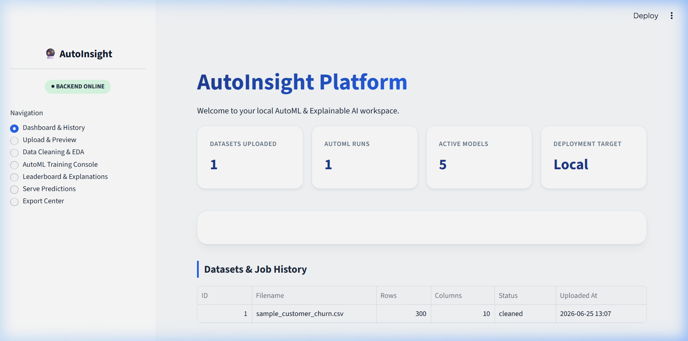
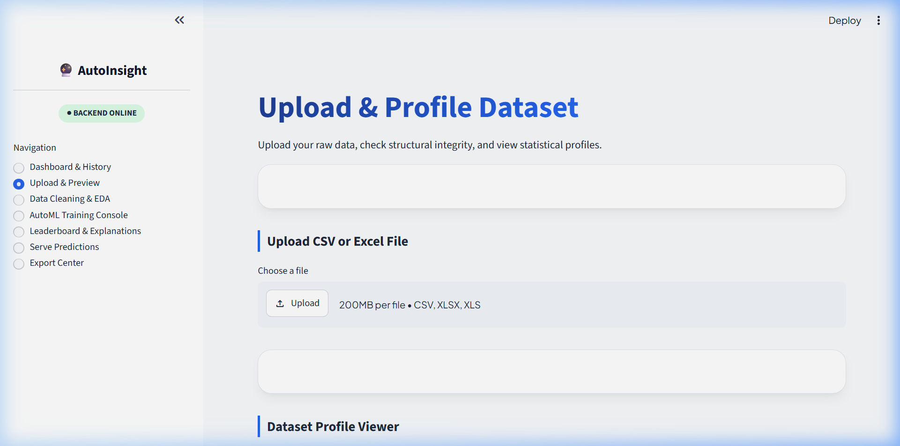
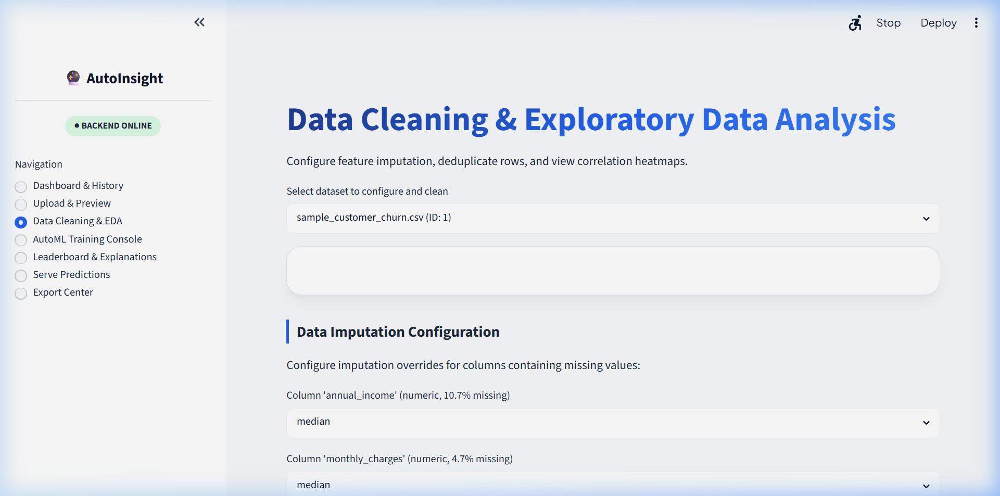
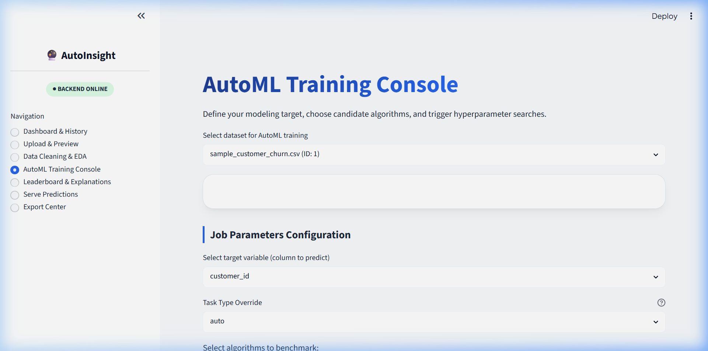
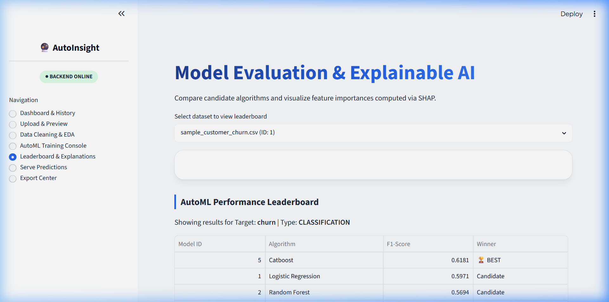

# 🔮 AutoInsight — Local AutoML & Explainable AI Platform

A **no-code, fully local** machine learning platform that takes raw tabular data (CSV/Excel) and automatically profiles, cleans, trains multiple ML models, ranks them, explains predictions using SHAP, and generates downloadable PDF/Excel reports — all from a single browser interface.

Built with **FastAPI** + **Streamlit** + **scikit-learn** + **XGBoost** + **LightGBM** + **CatBoost** + **SHAP**.

> **Zero cloud dependencies.** Everything runs on your laptop. No AWS, no Docker, no external APIs.

---

## ✨ Features

| Feature | Description |
|---------|-------------|
| **📂 Upload & Validation** | Drag-and-drop CSV/Excel files with automatic structural validation (encoding, headers, empty checks) |
| **📊 Auto Profiling** | Instant statistical profiling — missing values, outlier detection, data types, summary statistics |
| **🧼 Smart Cleaning** | Configurable imputation (mean, median, mode, constant) per column + automatic deduplication |
| **📈 Interactive EDA** | Correlation heatmaps and column distribution charts rendered with Plotly |
| **⚙️ AutoML Training** | Trains & tunes 5+ algorithms simultaneously with `RandomizedSearchCV` hyperparameter optimization |
| **🏆 Model Leaderboard** | Side-by-side comparison of all trained models ranked by F1-Score (classification) or R² (regression) |
| **🔮 SHAP Explainability** | Global feature importance plots + per-prediction waterfall explanations |
| **🎯 Live Predictions** | Single-instance prediction console with dynamic form generation from dataset schema |
| **📦 Batch Predictions** | Upload a CSV batch file and download predictions as a new CSV |
| **📄 Report Export** | Generate executive PDF summaries (ReportLab) and multi-sheet Excel workbooks (OpenPyXL) |

---

## 🏗️ Architecture

```
┌──────────────────────────────┐       ┌──────────────────────────────┐
│   Streamlit Frontend         │       │   FastAPI Backend             │
│   (localhost:8501)           │ HTTP  │   (localhost:8000)            │
│                              │◄─────►│                              │
│  • Dashboard & History       │       │  Routers:                    │
│  • Upload & Preview          │       │   ├── datasets.py            │
│  • Data Cleaning & EDA       │       │   ├── training.py            │
│  • AutoML Training Console   │       │   ├── models.py              │
│  • Leaderboard & SHAP        │       │   └── reports.py             │
│  • Serve Predictions         │       │                              │
│  • Export Center             │       │  Service Modules:            │
│                              │       │   ├── upload/                │
│  Built with:                 │       │   ├── validation/            │
│   Plotly charts              │       │   ├── profiling/             │
│   Custom CSS styling         │       │   ├── cleaning/              │
└──────────────────────────────┘       │   ├── eda/                   │
                                       │   ├── feature_engineering/   │
┌──────────────────────────────┐       │   ├── automl/                │
│   SQLite Database            │       │   ├── prediction/            │
│   (autoinsight.db)           │◄──────│   ├── explainability/        │
│                              │       │   └── reports/               │
│  Tables:                     │       │                              │
│   • datasets                 │       │  ORM: SQLAlchemy             │
│   • training_jobs            │       │  DB: SQLite                  │
│   • trained_models           │       └──────────────────────────────┘
│   • predictions              │
│   • explanations             │       ┌──────────────────────────────┐
│   • reports                  │       │   Local Filesystem           │
└──────────────────────────────┘       │   data/                      │
                                       │    ├── raw/        (uploads) │
                                       │    ├── cleaned/    (cleaned) │
                                       │    ├── models/     (.joblib) │
                                       │    ├── plots/      (SHAP)    │
                                       │    └── reports/    (PDF/XLS) │
                                       └──────────────────────────────┘
```

---

## 📸 Screenshots

### Dashboard & History


### Upload & Preview


### Data Cleaning & EDA


### AutoML Training Console


### Leaderboard & SHAP Explanations


---

## 🛠️ Tech Stack

| Layer | Technology |
|-------|-----------|
| **Frontend** | Streamlit, Plotly |
| **Backend API** | FastAPI, Uvicorn, Pydantic |
| **Database** | SQLAlchemy + SQLite |
| **ML Training** | scikit-learn, XGBoost, LightGBM, CatBoost |
| **Explainability** | SHAP |
| **Data Processing** | Pandas, NumPy |
| **Reporting** | ReportLab (PDF), OpenPyXL (Excel) |
| **Testing** | Pytest, HTTPX |

---

## 🚀 Quickstart

### Prerequisites
- Python 3.11+ installed

### Setup

```bash
# 1. Clone the repo
git clone https://github.com/Sidsidhuz/Enterprise-Data-Intelligence-Platform.git
cd Enterprise-Data-Intelligence-Platform

# 2. Create virtual environment
python -m venv venv

# Windows
venv\Scripts\activate
# macOS/Linux
source venv/bin/activate

# 3. Install dependencies
pip install -r requirements.txt
```

### Run

Open **two terminals** (both with the virtual environment activated):

```bash
# Terminal 1 — Start the backend API
uvicorn app.main:app --reload --port 8000
```

```bash
# Terminal 2 — Start the frontend UI
streamlit run frontend/streamlit_app.py --server.port 8501
```

Then open **http://localhost:8501** in your browser.

---

## 📖 Usage Walkthrough

### Step 1: Upload
Navigate to **Upload & Preview** → drag-and-drop a CSV file → click **Upload & Process**. The system validates the file and computes a full statistical profile automatically.

### Step 2: Clean
Go to **Data Cleaning & EDA** → select your dataset → choose how to handle missing values for each column (median, mean, mode, or a constant) → click **Apply Cleaning**. After cleaning, interactive EDA charts (correlation heatmap, column distributions) appear automatically.

### Step 3: Train
Open **AutoML Training Console** → select your **target column** (the value you want to predict, e.g., `churn`) → check the algorithms you want to benchmark → click **Start AutoML Training**. The system trains all selected models in the background and notifies you when finished.

### Step 4: Compare & Explain
Visit **Leaderboard & Explanations** → view a ranked comparison of all trained models → see the SHAP global feature importance plot showing which features matter most.

### Step 5: Predict
Go to **Serve Predictions** → select a trained model → fill in feature values → click **Generate Prediction**. You get the predicted value, confidence probability, and a SHAP waterfall chart explaining *why* the model made that specific prediction.

### Step 6: Export
Use **Export Center** → generate a **PDF report** (contains profiling tables, model leaderboard, SHAP charts) or an **Excel workbook** (structured metadata, model parameters, cleaned data sample).

---

## 📁 Project Structure

```
autoinsight/
├── app/
│   ├── main.py                          # FastAPI entrypoint
│   ├── config.py                        # Settings & paths
│   ├── database.py                      # SQLite engine & session
│   ├── models/                          # SQLAlchemy ORM models
│   │   ├── dataset.py
│   │   ├── training_job.py
│   │   ├── trained_model.py
│   │   ├── prediction.py
│   │   ├── explanation.py
│   │   └── report.py
│   ├── schemas/                         # Pydantic request/response schemas
│   │   ├── dataset.py
│   │   ├── training_job.py
│   │   ├── trained_model.py
│   │   ├── prediction.py
│   │   └── report.py
│   ├── routers/                         # API endpoint definitions
│   │   ├── datasets.py                  # Upload, profile, clean, EDA
│   │   ├── training.py                  # Start training, check status
│   │   ├── models.py                    # Model info, predictions
│   │   └── reports.py                   # Generate & download reports
│   └── modules/                         # Business logic services
│       ├── upload/
│       ├── validation/
│       ├── profiling/
│       ├── cleaning/
│       ├── eda/
│       ├── feature_engineering/
│       ├── automl/                      # Multi-algorithm training engine
│       ├── prediction/
│       ├── explainability/              # SHAP computation
│       └── reports/                     # PDF & Excel generation
├── frontend/
│   └── streamlit_app.py                 # Entire Streamlit UI (1000+ lines)
├── data/                                # Local file storage (auto-created)
├── tests/                               # Pytest test suite
├── requirements.txt
├── sample_customer_churn.csv            # Sample dataset for testing
└── autoinsight.db                       # SQLite database (auto-created)
```

---

## 🧪 Sample Dataset

A ready-to-use sample dataset is included: **`sample_customer_churn.csv`** (300 rows × 10 columns) with a binary `churn` target column for classification testing.

---

## 🤖 Supported Algorithms

| Algorithm | Classification | Regression |
|-----------|:-:|:-:|
| Logistic / Linear Regression | ✅ | ✅ |
| Random Forest | ✅ | ✅ |
| XGBoost | ✅ | ✅ |
| LightGBM | ✅ | ✅ |
| CatBoost | ✅ | ✅ |

The system automatically detects whether the task is **classification** or **regression** based on the target column's data type and cardinality.

---

## 📡 API Documentation

Once the backend is running, visit **http://localhost:8000/docs** for the interactive Swagger UI with all available endpoints.

---

## 📜 License

This project is open source and available under the [MIT License](LICENSE).

---

<p align="center">
  Built with ❤️ as a portfolio project demonstrating full-stack data science engineering.
</p>
